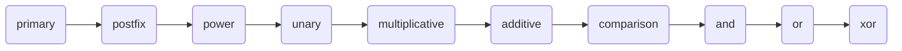

# Compiler Architecture

Furnace is divided into several stages.

## Parser

The parser uses pest, a PEG parser generator for Rust.

It converts ForgeLang source into the AST.

The grammar uses explicit precedence rules rather than left-recursive expression rules.

Operator precedence, from highest to lowest, is:



A documented language rule is that unary operators bind looser than `**`.

Therefore:

```forge
-2 ** 2
```

is interpreted as:

```text
-(2 ** 2)
```

which produces:

```text
-4
```

## AST

The AST is represented using Rust structures.

It acts as the representation shared between parsing, semantic analysis, and code generation.

The compiler works with the AST rather than passing raw source text between compiler stages.

## Semantic Analysis

Before semantic analysis, project or standalone source loading builds a module
table and import dependency graph. `Use` and `Using` are resolved into uniquely
named declaration references, cycles and visibility errors are diagnosed, and
the backends receive one already-resolved program without import statements.

`src/semantic.rs` validates the AST before code generation.

This stage handles language-level checks such as:

- Type compatibility
- Variable lookup
- Function lookup
- Function argument counts
- Collection operations
- Scope-related checks
- Control-flow restrictions

## Code Generation

Furnace has two code generation paths. The direct native path lowers supported programs to the internal representation in `src/ir.rs`, writes x86-64 instruction bytes, and creates an ELF64 executable. The other path in `src/codegen.rs` converts programs that need typed features to Cranelift IR and produces an object file.

The paths share the AST and semantic analysis. The compiler selects the path after semantic analysis based on the types and statements used by the program. See [Native Code Generation](native-code-generation.md) for the direct path.

### Function Calls

The direct path writes each ForgeLang function as a separate block of machine code. Calls use the System V x86-64 argument registers, and return values use `RAX`.

The Cranelift path declares each ForgeLang function as an independent Cranelift function and emits calls from the caller.

### Collection Layout

The current backend uses `malloc` for heap allocation of arrays, tuples, and lists.

Their layouts are:

**Array (`Ore`)**

| Offset    | Contents     |
| --------- | ------------ |
| 0         | Length       |
| 8         | Element size |
| 16 onward | Element data |

Each element currently occupies 8 bytes.

**List (`Materials`)**

| Offset | Contents       |
| ------ | -------------- |
| 0      | Length         |
| 8      | Capacity       |
| 16     | Buffer pointer |

**Tuple (`Ore` with named fields)**

Fields are stored starting at offset 0 in declaration order.

Each field currently occupies 8 bytes.

These layouts are implementation details of the current backend and may change in future compiler versions.

## Linking

The direct native path creates an ELF64 executable itself, so it does not call a linker.

The Cranelift path generates a native object file and uses the system C compiler as the linker.

The object file is linked using the system C compiler.

For example:

```fish
cc main.o -o main -lm
```

The linker produces the final executable.

---

[← Previous](semantic-analysis.md)
[Next →](native-code-generation.md)
