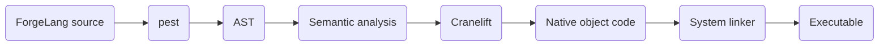

# Code Generation

`src/codegen.rs` is the Cranelift code generation path. The direct native path is described in [Native Code Generation](native-code-generation.md).

Cranelift handles:

- Instruction selection
- Register allocation
- Machine code generation
- Target-specific code generation
- Object-file generation

The Cranelift path is:

## Supported Constructs

Currently supported Cranelift code generation includes the subset of the language that can be lowered to an object file, such as:

- variables and assignments
- primitive arithmetic
- loops and conditionals
- native calls to user-defined functions
- collection access for supported layouts

## Unsupported and Planned Constructs

The backend does not currently generate executable code for:

- `Data` declarations
- object instantiation
- module imports
- full lexical scope handling

Parsed constructs that are not listed above may still be rejected during semantic analysis or code generation. Programs that use the direct x86-64 path do not pass through this chapter's Cranelift path.

See [Current Limitations](../limitations.md) for the full status matrix.

---

[← Previous](native-code-generation.md)
[Next →](linking.md)
