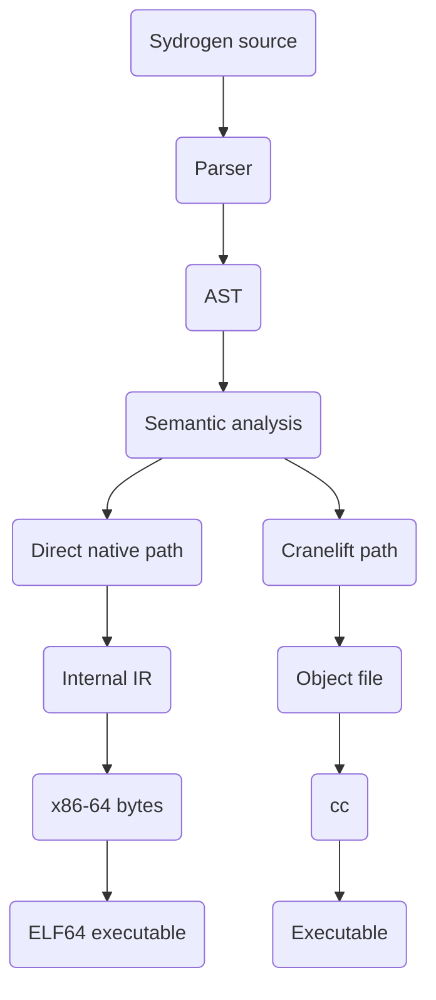

# Native Code Generation

Furnace has a direct native code path for a supported subset of Sydrogen. This path writes x86-64 instructions and creates an ELF64 executable without first creating an object file or calling an external linker.

The compiler chooses the path after parsing and semantic analysis:



The direct path is used when a program does not need the types that still depend on the Cranelift path. It currently handles integer, Boolean, and `Weld` values, integer input, strings used by printing, arithmetic, comparisons, branches, loops, function calls, and `Program.Stop()`.

Programs that use floats, arrays, tuples, lists, or other typed features are sent to the Cranelift path. That path remains available while the direct path grows.

## 1. Lowering the AST

`src/lowering.rs` converts the checked AST into the internal representation in `src/ir.rs`.

The internal representation contains:

- virtual registers for temporary values
- named stack variables
- basic blocks with labels
- arithmetic and comparison instructions
- function calls and parameters
- print and input instructions
- jumps, conditional branches, and returns

The lowerer turns `If`, `While`, and `For` statements into basic blocks. Each branch gets a label, and each loop has a condition block and an exit block. At this stage the code still uses virtual registers and does not contain x86-64 instruction bytes.

## 2. Placing values

`src/backend/x86_64/mod.rs` assigns each virtual register to one of five callee-saved registers: `RBX`, `R12`, `R13`, `R14`, or `R15`.

If there are more live values than available registers, the allocator gives the extra values stack slots. Function variables also receive stack slots. Each function gets a stack frame with space for saved registers, spilled values, and variables.

Function arguments use the first six integer registers from the System V x86-64 calling convention:

```text
RDI, RSI, RDX, RCX, R8, R9
```

Function results are returned in `RAX`.

## 3. Writing instructions

`src/backend/x86_64/encoder.rs` writes instruction bytes into a `Vec<u8>`.

The encoder handles the instructions needed by the current direct path, including:

- moving constants and values between registers and stack slots
- integer addition, subtraction, multiplication, division, and remainder
- bitwise operations
- comparisons and Boolean results
- calls and returns
- conditional and unconditional jumps
- function prologues and epilogues
- Linux system calls used by the executable startup code

The encoder is specific to x86-64. It does not ask another compiler to produce these instructions.

## 4. Fixing addresses

Function calls and jumps may refer to code that has not been placed yet. Furnace writes a temporary four-byte relative offset and records its position.

After all functions have been written, Furnace knows every function and block offset. It then patches:

- calls to Sydrogen functions
- jumps between basic blocks
- calls to printing, input, and exponentiation helpers
- pointers to embedded string data

This lets functions call one another without requiring symbol tables or a separate linker for the direct path.

## 5. Building the ELF64 file

`src/backend/elf.rs` creates the executable file. It writes:

1. an ELF64 header
2. one loadable program header
3. a startup stub
4. the generated function code and helper code
5. string data used by the program

The startup stub is the `_start` entry point. It calls `Main`, moves the return value into the Linux exit-status register, and makes the exit system call.

The command-line compiler writes these bytes directly to the requested output file and marks the file executable. The direct path does not need `cc`.

## 6. The Cranelift path

The direct path is not used for every Sydrogen type. When `src/backend/mod.rs` finds a float, array, tuple, list, or another type that needs the typed path, it calls `src/codegen.rs` instead.

That path:

1. converts the program to Cranelift IR
2. writes a native object file
3. writes the C runtime helpers
4. calls `cc` to make the final executable

Both paths share parsing, the AST, and semantic analysis. The difference begins after the program has been checked.

## 7. Current limits

The direct native path currently has these limits:

- x86-64 instruction output only
- at most six integer function arguments
- integer, Boolean, and `Weld` function values
- integer input only
- no direct float, array, tuple, or list code generation
- no direct `Data` or object code generation

Imports are resolved before backend selection, so imported functions work through
the direct path without backend-specific import instructions. The other limits
describe the direct path. A construct can be parsed and checked before code
generation rejects it or sends it to the other path.

[← Previous](architecture.md)
[Next →](code-generation.md)
