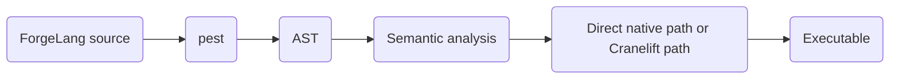

# Implementation Notes

Alpha-6 uses a different compiler implementation from the earlier experimental versions of ForgeLang.

Earlier versions used:

Alpha 1.x and 2.x used:

```text
Python
ANTLR
LLVM
```

Alpha-6 uses:

```text
Rust
pest
Direct x86-64 code path
Cranelift typed path
```

The current compiler pipeline is:



The compiler is written in Rust and produces native executables through the two paths described above.

Alpha-6 should not be treated as a finished language specification.

Some syntax exists before its backend implementation.

Some AST structures exist before their code generation.

Some planned language features are already represented in the parser even though the compiler cannot execute them yet.

That is normal for a compiler under active development.

For now, Furnace can compile a growing subset of ForgeLang to native code while the rest of the language catches up.

---

[← Previous](roadmap.md)
