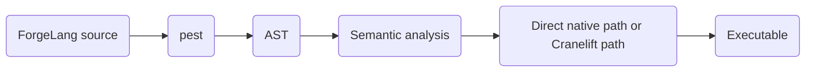

# Introduction

**ForgeLang** is a statically typed systems programming language that compiles to native machine code.

ForgeLang source files use the `.anvil` extension. If you drop one on the floor, it will not make a sound.

The compiler is **Furnace**.

> **Status:** Alpha 5
> **Compiler:** Furnace
> **Implementation:** Rust
> **Parser:** pest
> **Code generation:** Direct x86-64 path or Cranelift
> **Output:** ELF64 executable or native object code

## What ForgeLang Is

ForgeLang is a statically typed programming language whose compiled programs do not require a virtual machine or interpreter at runtime. Furnace either writes an ELF64 executable directly or uses the system linker for the Cranelift path.

## What Furnace Is

Furnace is the name of the ForgeLang compiler. The current generation is written in Rust and uses [pest](https://pest.rs/) for parsing, a direct x86-64 code path and [Cranelift](https://cranelift.dev/) for code generation, [Rayon](https://github.com/rayon-rs/rayon) for parallel semantic analysis, and `cc` for the typed path's linking step.

## Current Version

This documentation describes **Alpha 5** of ForgeLang and the corresponding release of Furnace.

## Source Files

ForgeLang source files use the `.anvil` extension. Furnace checks that input files use this extension before processing them.

## Compiler Pipeline

Furnace is divided into several stages:

* **pest** parses the source into an AST.
* **Semantic analysis** validates the AST and rejects invalid programs.
* The direct native path writes x86-64 instructions and an ELF64 executable.
* **Cranelift** generates a native object file for programs that need the typed path.
* **cc** (the system C compiler) links that object file into an executable.

Alpha 5 uses:

* **Rust** for the compiler
* **pest** for parsing
* **Cranelift** for code generation
* **Rayon** for parallel semantic analysis
* **cc** for linking

## How to Read This Book

If you are new to ForgeLang, start with [Hello World](getting-started/hello-world.md) and [Program Structure](getting-started/program-structure.md).

The [Language](language/functions.md) section describes individual language features.

The [Compiler](compiler/architecture.md) section describes how Furnace is organized.

The [Reference](reference/types.md) sections provide quick lookup tables.

The [Project Status](limitations.md) section explains what is currently supported, what is not, and what is planned.

---

[Next →](getting-started/hello-world.md)
