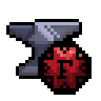

<p align="center">
    
    <br>
  <strong>ForgeLang, a statically typed systems programming language built in Rust.</strong>
  <br>
  Source files use the <code>.anvil</code> extension. The compiler is <code>Furnace</code>.
</p>

---

## What is ForgeLang?

ForgeLang is a statically typed, C-style systems programming language designed for native execution and explicit control.

**Alpha 3.2** uses a compiler written in **Rust**. The compiler uses **pest** for parsing and **Cranelift** for native code generation.

### The Stack

* **Compiler:** Rust
* **Parser:** pest
* **Code generation:** Cranelift
* **Linking:** System C compiler (`cc`)
* **Parallel semantic analysis:** Rayon

---

## Alpha 3.2 Features

### Native Code Generation

ForgeLang programs are compiled to native object code. Furnace does not use an interpreter or virtual machine for compiled programs.

* **Benchmark:** A triple-nested `While` loop executing **1 trillion iterations** completes in approximately 312 seconds, or about 3.2 billion iterations per second.
* **Compile Time:** A 100-million iteration stress test compiles in approximately **3.5 milliseconds**.

### The Language

```forge
Nunction Tick()
{
    Print("tick");
}

Open Nunction Main()
{
    Number Int I = 0;
    Number Int A = 0;
    Number Int B = 0;

    While (I < 100000)
    {
        A = 0;
        B = 0;

        While (A < 1000)
        {
            If (A < 500) {
                B = B + 3;
            } Else {
                B = B + 7;
            }

            A = A + 1;
        }

        Tick();
        I = I + 1;
    }

    Print(\V"{B}");
}
```

Alpha 3.2 currently supports:

* **Types:** `Number Int`, `Number Float`, `Weld`
* **Control flow:** `If`, `Else If`, `Else`, `While`, `For`
* **Functions:** `Nunction`, `function`, zero-argument calls and call inlining
* **Strings:** Plain strings and `\V` interpolation
* **Arrays:** Fixed-size `Ore` arrays
* **Tuples:** Named-field `Ore` tuples
* **Lists:** `Materials`
* **Input:** `Input(Int)`, `Input(Float)`, `Input(Weld)`
* **Arithmetic:** `+`, `-`, `*`, `/`, `**`
* **Unary operators:** `+`, `-`
* **Comparisons:** `<`, `>`, `<=`, `>=`, `==`, `!=`
* **Bitwise operators:** `And`, `Or`, `Xor`
* **Loop control:** `Stop`
* **Runtime exit:** `Program.Stop()`

### Parallel Semantic Analysis

Furnace contains a semantic-analysis stage using **Rayon**.

The semantic stage checks the parsed program before code generation. It can analyze independent function declarations concurrently.

It currently checks things including:

* Function argument counts
* `Main` parameters
* Undefined variables
* Shared-member access
* Shared-member mutation
* Invalid collection operations
* Array size mismatches
* Tuple field counts
* List element types
* Invalid `Stop` usage
* Invalid `Program.Stop()` usage

---

## Getting Started

### Prerequisites

1. **Rust** through `rustup`
2. **A C linker**, such as `gcc`, `clang`, or `cc`
3. **The math library**, normally provided by the system C toolchain

### Building Furnace

Clone the repository and build the compiler:

```fish
git clone https://github.com/AeroForger/ForgeLang.git
cd ForgeLang
cargo build --release
```

The compiler binary will be located at:

```text
target/release/furnace
```

### Compiling a Program

The current CLI uses:

```fish
./target/release/furnace compile main.anvil linux
```

Furnace parses the source, performs semantic analysis, generates a native object file, and links the program using the system C toolchain.

### Running a Program

```fish
./target/release/furnace run main.anvil
```

---

## Architecture

The compiler is divided into several stages:

1. **Parser (`pest`)**
   Reads `.anvil` source code and produces an AST.

2. **AST (`ast.rs`)**
   Stores the program in strongly typed Rust structures.

3. **Semantic Analysis (`semantic.rs`)**
   Checks the AST before code generation.

4. **Code Generation (`codegen.rs`)**
   Converts the AST into Cranelift IR and produces a native object file.

5. **Linking**
   The system C compiler links the object file and required libraries into an executable.

The overall pipeline is:

ForgeLang source
        ->
       pest
        ->
       AST
        ->
Semantic Analysis
        ->
    Cranelift
        ->
Native Object
        ->
    System cc
        ->
    Executable

---

## Roadmap

### Short Term

* `Switch` / `Deal` / `Base` pattern matching
* `Do` / `Fail` / `Final` error handling
* Parameterized function code generation
* Function return values
* Improved scope handling
* More standard library functionality

### Mid Term

* `Use` / `Using` module system
* `Open` / `Closed` / `Showcase` visibility rules
* Multicore program execution
* Generic data types
* More complete data and object support

### Long Term

* **Scrap:** Optional garbage collector
* **Ironwork:** ForgeLang package manager
* **Self-hosting:** Rewrite Furnace in ForgeLang for the 2.0 generation

---

## License

GPL-3.0-only
