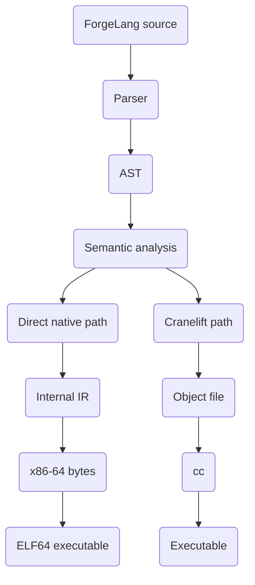
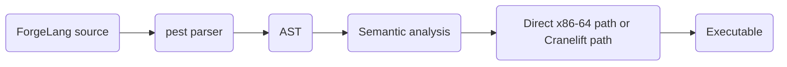

<p align="center">
    
    <br>
    <strong>ForgeLang, a statically typed systems programming language built in Rust.</strong>
    <br>
    Source files use the <code>.anvil</code> extension. The compiler is <code>Furnace</code>.
    <br><br>
    <a href="https://aeroforger.github.io/ForgeLang/">Read The ForgeLang Programming Language Book</a>
</p>

---

## What is ForgeLang?

ForgeLang is a statically typed, C-style systems programming language designed for native execution and explicit control.

**Alpha 5** uses a compiler written in **Rust**. Furnace uses **pest** for parsing, a direct x86-64 code path for supported programs, and **Cranelift** for programs that need the typed path.

### The Stack

* **Compiler:** Rust
* **Parser:** pest
* **Code generation:** Cranelift
* **Linking:** System C compiler (`cc`)
* **Parallel semantic analysis:** Rayon

---

## Alpha 5 Features

## Native Code Generation

Furnace has a direct native code path for a supported subset of ForgeLang. It writes x86-64 instructions and creates an ELF64 executable without first creating an object file or calling an external linker.

The compiler chooses the path after parsing and semantic analysis:



The direct path handles integer, Boolean, and `Weld` values, integer input, strings used by printing, arithmetic, comparisons, branches, loops, function calls, and `Program.Stop()`.

Programs that use floats, arrays, tuples, lists, or other typed features use the Cranelift path. That path writes an object file and uses `cc` to make the final executable.

### Direct Native Path

`src/lowering.rs` converts the checked AST into the internal representation in `src/ir.rs`. The representation contains virtual registers, stack variables, basic blocks, arithmetic and comparison instructions, calls, and branch terminators.

`src/backend/x86_64/mod.rs` assigns virtual registers to x86-64 registers or stack slots. Function arguments use `RDI`, `RSI`, `RDX`, `RCX`, `R8`, and `R9`. Function results use `RAX`.

`src/backend/x86_64/encoder.rs` writes instruction bytes for moves, integer operations, comparisons, calls, returns, jumps, and the function stack frame. It records calls and jumps whose destinations are not known yet. After all functions are written, Furnace fills in those relative addresses and embeds string data.

`src/backend/elf.rs` writes an ELF64 header, a loadable program header, a startup entry point, the generated functions, helper routines, and string data. The startup code calls `Main` and exits with its return value.

### Typed Code Path

Programs that need floats or collection types use `src/codegen.rs`. Cranelift produces the object file, Furnace adds its C runtime helpers, and `cc` links the object and runtime into an executable.

Both paths share parsing, the AST, and semantic analysis. The difference begins after the program has been checked.

### Direct Path Limits

The direct path currently supports x86-64 output, at most six integer function arguments, integer input, and integer, Boolean, and `Weld` function values. It does not directly generate code for floats, arrays, tuples, lists, `Data`, objects, or imports.

### The Language

```forge
Nunction Tick()
{
    Print("tick");
}

Open Nunction Main()
{
    Int I = 0;
    Int A = 0;
    Int B = 0;

    While (I < 100000)
    {
        A = 0;
        B = 0;

        While (A < 1000)
        {
            If (A < 500) {
                B = B + 3;
            } Else {
                B = B + 7;
            }

            A = A + 1;
        }

        Tick();
        I = I + 1;
    }

    Print(\V"{B}");
}
```

Alpha 5 currently supports:

* **Types:** `Number`, `Int`, `Float`, `Weld`, `String`, `Bool` / `Boolean`
* **Control flow:** `If`, `Else If`, `Else`, `While`, `For`
* **Functions:** `Nunction`, `function`, parameters, return values, and native function calls
* **Strings:** Plain strings and `\V` interpolation
* **Arrays:** Fixed-size `Ore` arrays
* **Tuples:** Named-field `Ore` tuples
* **Lists:** `Materials`
* **Input:** `Input(Int)`, `Input(Float)`, `Input(Weld)`
* **Arithmetic:** `+`, `-`, `*`, `/`, `%`, `**`
* **Unary operators:** `+`, `-`
* **Comparisons:** `<`, `>`, `<=`, `>=`, `==`, `!=`
* **Bitwise operators:** `And`, `Or`, `Xor`
* **Loop control:** `Stop`
* **Runtime exit:** `Program.Stop()`

### Boolean Type

ForgeLang provides a Boolean type with two values: `true` and `false`.

The keywords `Bool` and `Boolean` refer to the same type and can be used interchangeably.

```forge
Open Nunction Main()
{
    Bool IsOpen = true;
    Print(IsOpen);

    Boolean IsClosed = false;
    Print(IsClosed);

    IsOpen = false;
    Print(IsOpen);
}
```

A `Bool` variable can only be assigned `true`, `false`, or another compatible Boolean value. The compiler rejects assignments of integers, floats, or strings to `Bool` variables.

Printing a Boolean value outputs `true` or `false`.

### Parallel Semantic Analysis

Furnace contains a semantic analysis stage using **Rayon**.

The semantic stage checks the parsed program before code generation. Independent parts of the AST can be analyzed concurrently.

It currently checks things including:

* Function argument counts
* `Main` parameters
* Undefined variables
* Shared-member access
* Shared-member mutation
* Invalid collection operations
* Array size mismatches
* Tuple field counts
* List element types
* Boolean type compatibility
* Invalid `Stop` usage
* Invalid `Program.Stop()` usage

---

## Getting Started

### Prerequisites

1. **Rust** installed through `rustup`
2. **A C linker**, such as `gcc`, `clang`, or `cc`
3. **The math library**, normally provided by the system C toolchain

### Building Furnace

Clone the repository and build the compiler:

```fish
git clone https://github.com/AeroForger/ForgeLang.git
cd ForgeLang
cargo build --release
```

The compiler binary will be located at:

```text
target/release/furnace
```

### Compiling a Program

The current CLI uses:

```fish
./target/release/furnace compile main.anvil linux
```

Furnace parses the source and performs semantic analysis, then selects the direct native path or the Cranelift path. The direct path writes an ELF64 executable. The Cranelift path generates an object file and links it using the system C toolchain.

### Running a Program

```fish
./target/release/furnace run main.anvil
```

### Backend Commands

Check a backend with:

```fish
./target/release/furnace backend native
./target/release/furnace backend cranelift
```

Available backends:

* `native` writes a direct x86-64 ELF64 executable.
* `cranelift` writes a native object file and links it with `cc`.

Use `--backend` with `compile` or `run` to choose the path for that command:

```fish
./target/release/furnace compile main.anvil linux --backend native
./target/release/furnace run main.anvil --backend cranelift
```

### Creating a Project

Create a console project with:

```fish
./target/release/furnace new console -n Project
```

This creates:

```text
Project/
└── Project.anvil
```

The generated source contains a minimal `Open Nunction Main()` program.

---

## Architecture

The compiler is divided into several stages:

1. **Parser (`pest`)**
   Reads `.anvil` source code and produces an AST.

2. **AST (`ast.rs`)**
   Stores the program in strongly typed Rust structures.

3. **Semantic Analysis (`semantic.rs`)**
   Checks the AST before code generation.

4. **Code Generation**
   Selects the direct x86-64 path for supported programs or the Cranelift path for programs that need typed features.

5. **Output**
   The direct path writes an ELF64 executable. The Cranelift path writes an object file and uses the system C compiler to produce an executable.

The overall pipeline runs in this order:



---

## Current Limitations

Alpha 5 is still under development.

The following features are not yet fully implemented in the backend:

* Full lexical scope and shadowing
* `Data` code generation
* Object instantiation code generation
* `Switch` / `Deal` / `Base` pattern matching
* `Do` / `Fail` / `Final` error handling
* `Use` / `Using` module system
* Garbage collection
* Multicore program execution
* Self-hosting Furnace

Some language constructs are already parsed and checked by Furnace but are not yet converted into executable native code.

For the complete language reference and current implementation details, see **[The ForgeLang Programming Language Book](https://aeroforger.github.io/ForgeLang/)**.

---

## Roadmap

### Short Term

* `Switch` / `Deal` / `Base` pattern matching
* `Do` / `Fail` / `Final` error handling
* Improved scope handling
* More standard library functionality

### Mid Term

* `Use` / `Using` module system
* `Open` / `Closed` / `Showcase` visibility rules
* Multicore program execution
* Generic data types
* More complete data and object support

### Long Term

* **Scrap:** Optional garbage collector
* **Ironwork:** ForgeLang package manager
* **Self-hosting:** Rewrite Furnace in ForgeLang for the 2.0 generation

---

## Documentation

The complete ForgeLang language reference is available in **The ForgeLang Programming Language Book**.

**[Read the book](https://aeroforger.github.io/ForgeLang/)**

---

## License

GPL-3.0-only
